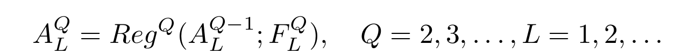
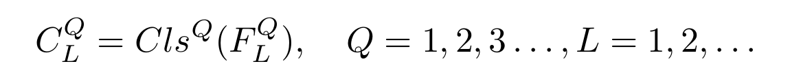
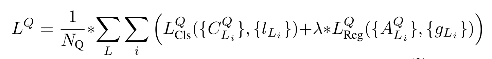

## 2018-06-11

**《Single-Shot Bidirectional Pyramid Networks for High-Quality Object Detection》**  

**arXiv 2018**  

**Abstract:** 最近几年见证了许多令人激动的深度学习技术用于目标检测的成就。除了获得值得注意的进步，大多数已存在的检测器检测相对低质量的位置预测，如通常以默认IoU临界值0.5进行训练，这导致低质量甚至噪音检测。如何制定并训练不牺牲检测性能就可以获得更精确位置(如IoU>0.5)的高质量检测器仍然是一个挑战。本文中，我们提出一个全新的单镜头Bidrectional Pyramid Networks(BPN)检测框架，进行高质量目标检测，它含有两个全新的组成部分：(i) 一个Bidirectional Feature Pyramid结构得到更有效且强壮的特征图表达；以及(ii) 一个Cascade Anchor Refinement来逐步精炼预定的Anchors的精度来得到更有效的训练。实验显示，在PASCAL VOC和MS COCO数据集上，BPN在所有单阶段检测器中获得最好的性能，尤其对于高质量检测。  

**Note:**  
  
  
  

**Framework:**  

**Link:** https://arxiv.org/abs/1803.08208  

---
**《Learning Region Features for Object Detection》**  

**arXiv 2018**

**Abstract:** 尽管现代目标检测的大多数步骤是可学习的，区域特征提取仍然主要靠手工，以ROI　pooling方法为特征。本文提出一个通用框架，统一现有的区域特征提取和一个全新的端到端可学习的方法。方法去掉大多数启发式选择，超过RoI　pooling的对比样本。向全可学习目标检测更近一步。

**Note:**  
A new method about ROI pooling in two-stage detector framework, using weighted sum, not maximum or average or bilinear interpolation of the bin of grids.

**Link:** https://arxiv.org/abs/1803.07066  
