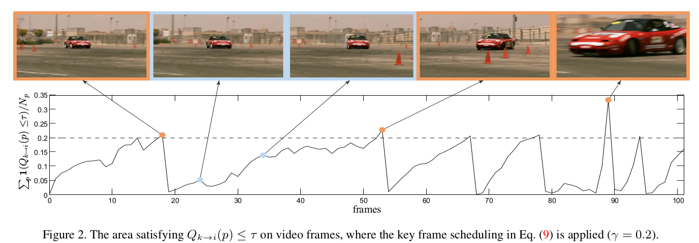
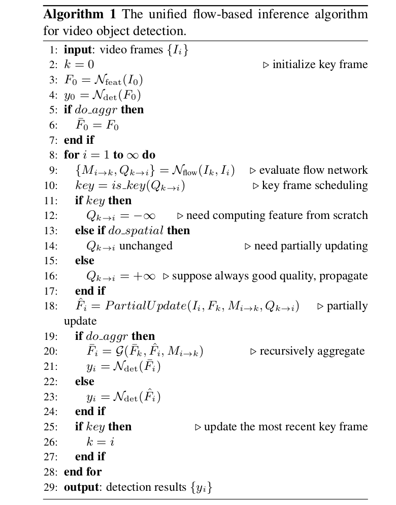

## 2018-06-29

**《Towards High Performance Video Object Detection》**  

**CVPR 2018 SPOTLIGHT**  

**Abstract:** 最近几年图像目标检测已经有显著进步。然而视频目标检测却收到较少关注，尽管它更具挑战性且在实际情景中更重要。基于最近[37,36]的工作，本文提出一个统一的基于多帧end-to-end特征学习和跨帧移动原则的方法。我们的方法以三个新技术扩展了以前的工作，坚实的推进了性能上界(速度/准确度权衡)，直向高性能视频目标检测。  

**Note:**  

**Sparse Feature Propagation:** Feature maps on non-key frame i are propagated from its preceding key frame k using frame pixel-wise motion of a two dimensional motion field Mi->k, that denotes as Fk->i = W(Fk, Mi->k). Detection network works on Fi-k instead of Fi computing from feature extractor network. Motion field Mi->k is estimated by a lightweight flow network Nflow(Ik, Ii) = Mi->k, which takes two frames Ik, Ii as input. So it is fast because of the lightweight network Nflow.  

**Dense Feature Aggregation:** For any frame i, feature maps of all frames within a temporal window [i-r, i+r] are warped onto frame i in the same way as Fj->i = W(Fk, Mi-j) (j in [i-r, i+r]). Juse like every frame is a key frame. Fi at frame i is obtained as the weighted average of all such feature maps. The weight is adaptively computed as the similarity between the propagated feature maps Fk->i and the real feature maps Fi calculated by feature extractor.  

**Sparsely Recursive Feature Aggregation:** For two key frames k and k', aggregated feature at frame k' is Fk' = Wk->k'×Fk->k' + Wk'->k'×Fk'. This is a recursive vesion of Dense Feature Aggregation, and Fk->k' = W(Fk, Mk'->k) as Sparse Feature Progation, and × denotes element-wise multiplication, and weight is correspondingly normalized  by Wk->k' + Wk'->k- = 1.  

**Spatially-adaptive Partial Feature Updating:** To quantify whether the propagated feature Fk->i is a good approximation of Fi, a feature temporal consistency Qk->i is introduced, then together with motion field Mi-k, we have {Mi-k, Qi-k} = Nflow(Ik, Ii). If Qk-i(p) less equal t, the propagated feature Fk->p(p) is inconsisent with the real feature Fi(p), that means Fk-i(p) is a bad approximation and we shall update with real feature Fi(p). So we have Fi = Uk-i×Nfeat(Ii) + (1-Uk-i)×Fk-i, where Uk->i = 1 if Qk-i(p) less equal t, and Uk-i(p) = 0 otherwise. Only Update partial feature maps.  

**Temporally-adaptive Key Frame Scheduling:** If Qk-i(p) less equal t for all position on the image, or most position, we shall mark this frame as a new key frame. Generally, we can denote key = is_key(Qk-i) = sum(1 if (Qk-i(p) less equal t) else 0)/Np as a indicator. If key > threshold, there is a new key frame and we shall recompute feature maps. This scheduling policy is adaptive to the varying dynamics in temporal domain, not like a naive scheduling policy as picking a key frame at a prefixed rate.  

**Framework:**  

**Flow network:** FlowNet  
**Feature network:** ResNet-101  
**Detection netork:** R-FCN  

**Link:** https://arxiv.org/abs/1711.11577  
