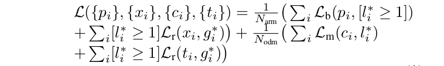
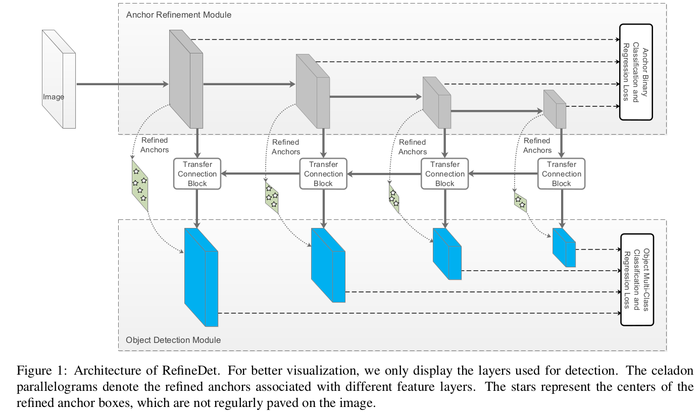
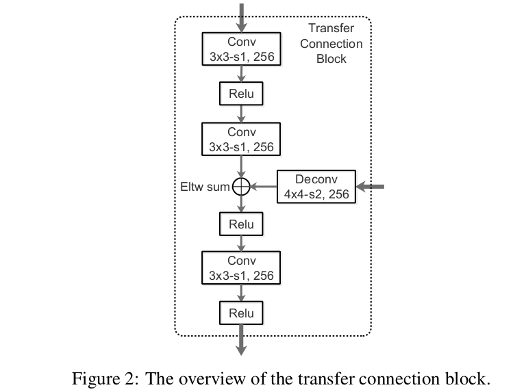

## 2018-07-01

**《Single Shot Refinement Neural Netork for Object Detection》**  

**CVPR 2018 POSTER**  

**Abstract:** 对于目标检测，两阶段方法(如Faster R-CNN)取得了最高的准确度，同时单阶段方法(如SSD)有高效率的优势。为了继承两者的有点同时克服它们的缺点，本文中，我们提出一个全新的基于单阶段的检测器，叫做RefineDet，获得比两阶段方法更好的准确度并保持与单阶段方法相当的效率。RefineDet包含两个内连接模块，称为anchor细化模块和目标检测模块。特别的，前一个目的是(1)过滤负anchors为分类器降低搜索空间，以及(2)粗略调整anchors的位置和尺寸，为后续回归器提供更好的初始值。后一个模块从前一个模块接收细化的anchors作为输入，进一步改进回归和预测多类别标签。同时，我们使用传输连接块，在anchor细化模块中传输特征来预测位置、尺寸，以及在目标检测模块中预测目标类别标签。多任务损失函数使我们能够以end-to-end的方式训练整个网络。大量的PASCAL VOC2007、PASCAL VOC2012和MS COCO上的实验证明，RefineDet获得最新水平检测准确度，同时有着高效率。代码链接：[https://github.com/sfzhang15/RefineDet](http://github.com/sfzhang15/RefineDet)。  

**Note:**  
Not very clear. There are no figures and detials about how anchor refinement module and object detection module work. It confused me.

**Framework:**  

**Link:** https://arxiv.org/abs/1711.06897  

