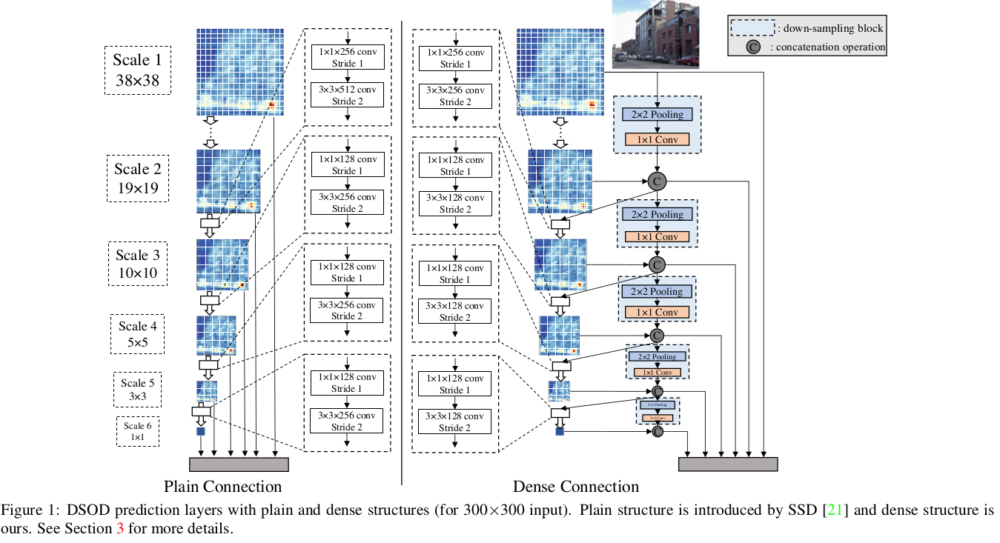

## 2018-07-06

**《DSOD: Learning Deeply Supervised Object Detectors from Scratch》**  

**ARXIV 17.08**  

**Abstract:** 我们展示Deeply Supervised Object Detector(DSOD)，一个可以从零学习的目标检测器框架。最新水平目标检测器严重依赖现成的在大尺度分类数据集上预训练的网络，如ImageNet，由于在分类和检测任务上损失函数和类别分布的不同，这会引发学习偏差。为检测任务进行的模型微调会将偏差减轻到一个范围，但不能根本解决。另外在有差异的数据域之间从分类到检测平移预训练模型甚至更难(如RGB到深度图像)。一个更好的处理这两个关键问题的解决方案是从零开始训练目标检测器，这点激发了我们提出的DSOD。之前的这个方向的努力大多失败了，由于目标检测中复杂得多的损失函数和受限的训练数据。在DSOD中，我们贡献了一组从零开始训练目标检测器的原则。关键发现之一是深度监督在学习一个好的检测器中扮演了关键角色，密集层连接使其成为可能。结合其他几个原则，我们继承single-shot detection(SSD)框架发展了DSOD。在PASCAL VOC 2007 2012和MS COCO数据集上的实验证明，DSOD可以以更紧凑的模型达到比最新水平解决方案更好的结果。例如，DSOD以实时检测速度在三个标准实验中超越SSD，同时需要仅SSD的1/2参数和Faster RCNN的1/10参数。代码链接：[https://github.com/szq0214/DSOD](http://github.com/szq0214/DSOD)。  

**Note:**  

**Framework:**  

**Link:** https://arxiv.org/abs/1708.01241  

