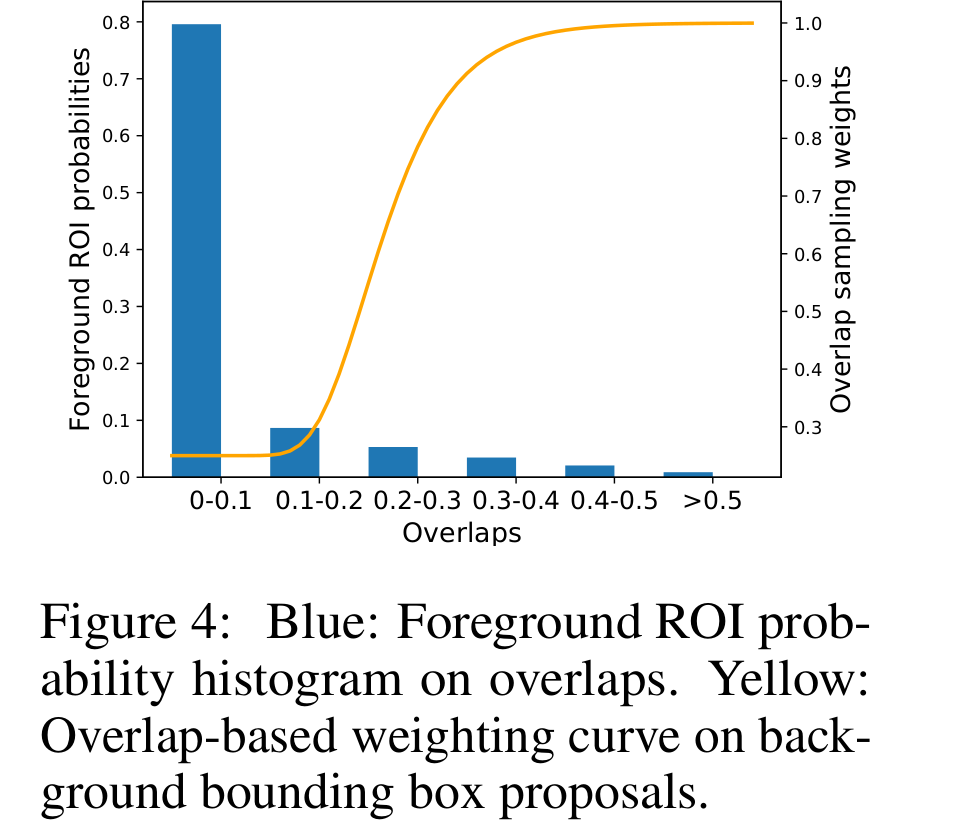

## 2018-07-09

**《Soft Sampling for Robust Object Detection》**  

**ARXIV 1806**  

**Abstract:** 我们研究目标检测器在发生缺失注释时的强壮性。这个设定下，无标注目标实例将被处理为背景，这将对检测器产生不正确的训练信号。有趣的是，我们观察到在PASCAL VOC数据集上，在丢失30%注释(并将它们标注为背景)之后，基于CNN的检测器如Faster-RCNN的性能仅下降5%。我们提供了一个这个结果的详细解释。为了进一步跨越性能差距，我们提出一个简单但高效的解决方法呢，叫做Soft Sampling。Soft Sampling以与正实例重叠度的函数重调整RoI的梯度。这保证不确定的背景区域相比hard-negative样本给出更小的权重。在副PASCAL VOC数据集上的更多实验证明提出的Soft Sampling方法在不同注释降低率下的有效性。最后，我们展示了在OpenImageV3上，这是一个缺失注释的真实世界数据集，Soft Sampling超越标准检测基线3%。  

**Note:**  
Decay(re-weight) the gradients for each RoI as a function of its overlap with positive instances. So that all positives and hard negatives will contribute significantly to the gradients, and background regins contribute to the gradient with a lower weight. We use Gompertz function in implemention.  

**Framework:**  

**Link:** https://arxiv.org/abs/1806.06986  

