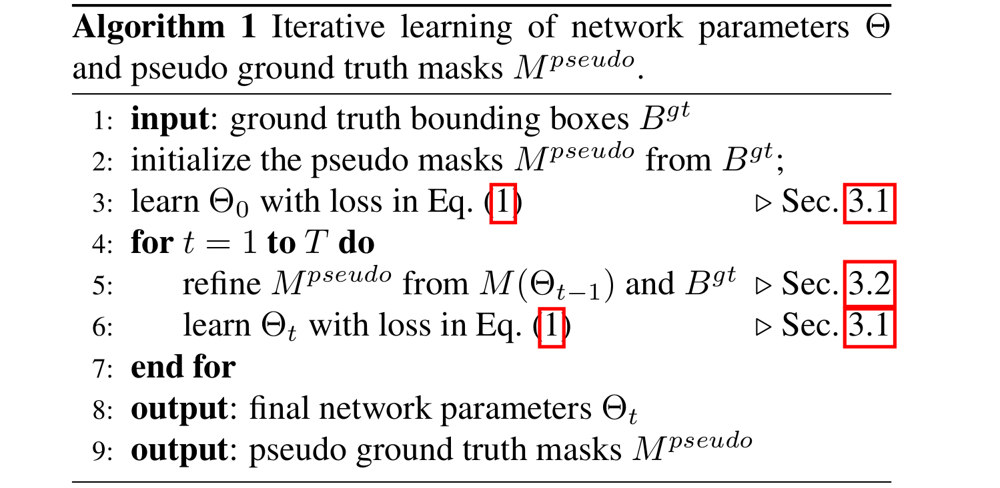
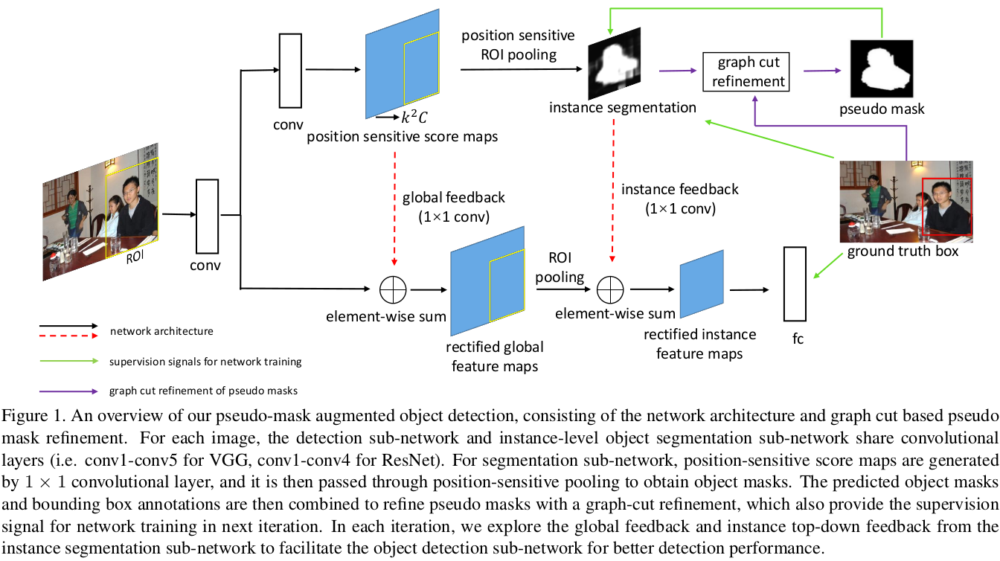

## 2018-07-10

**《Pseudo Mask Augmented Object Detection》**  

**CVPR 2018**  

**Abstract:** 本文中，我们展示一个全新且高效的框架，利用仅以边界框注释监督的实例层面分割信息促进目标检测。从联合目标检测和实例分割网络开始，我们提出循环评估来自实例层面目标分割网络训练的pseudo ground-truth object masks，然后利用top-down分割反馈增强检测网络。pseudo ground-truth mask和网络参数交替优化，互相受益于对方。为了在每个循环中得到理想的pseudo mask，我们嵌入一个包含低层图像外观一致性和边界框注释的图推断，来微调分割网络预测的segmentation mask。我们的方法通过结合自弱监督分割网络学习的细部像素级信息，逐渐增强目标检测器性能。在PASCAL VOC 2007和2012上的额外评估验证了提出方法的有效性。  

**Note:**  
1. Joint Segmentation and Detection. Since segmentation masks are unknown, optimizing procedure follows a EM-like way.  
2. Using Graphical Models for pseudo segmentation mask refinement.  
3. Weakly Supervised Segmentation.  

**Framework:**  

**Link:** https://arxiv.org/abs/1803.05858  
