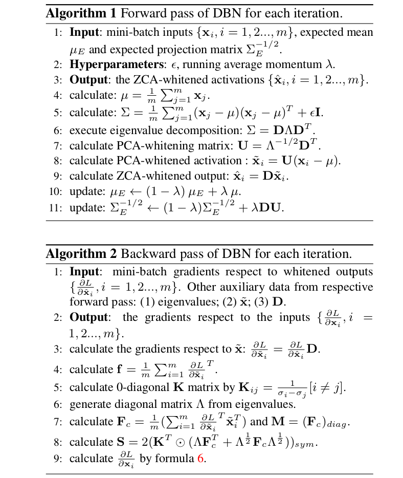
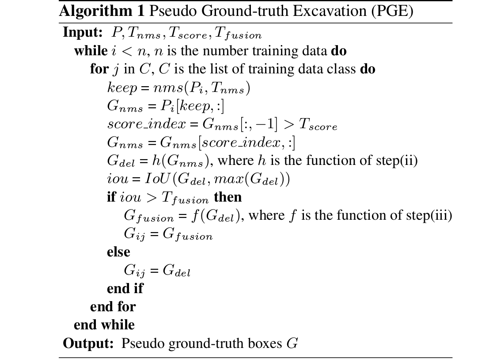
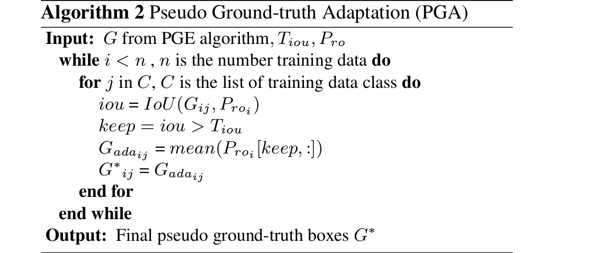

## 2018-07-11

**《Decorrelated Batch Normalization》**  

**CVPR 2018**  

**Abstract:** Batch Normalization在加速深度模型训练中很强力，通过在mini-batch中的中心化和缩放激活值。本文中，我们提出Decorrelated Batch Normalization(DBN)，它不仅中心化和缩放激活值，还白化它们。我们尝试多种白化操作，发现PCA白化引起一个我们称之为随机坐标轴对换的问题，不利于训练。我们展示ZCA白化不会忍受这个问题，允许成功训练。DBN保留BN令人满意的质量，进一步改进BN的优化效率和泛化能力。我们进行大量的实验展示，DBN可以在多层感知机和卷积神经网络上改进BN的性能。更多的，我们坚实的改进残差网络在CIFAR-10、CIFAR-100和ImageNet上的准确度。  

**Note:**  
1. Batch Normalization performs standardization on mini-batch inputs, that is not enough. We add ZCA whitening operation, not using PCA because it will cause stochastic axis swapping.  

2. There are a lot of formulas that cant be written here, because github dont support Markdown gammar for README.md. It is a clear derivation, including forward pass and backward pass.  

3. Origin derivation asume that the shape of input is R-(d×m), where d is the dimension of one sample and m is mini-batch size. For a convolulation neural network, the shape of input is R-(h×w×d×m), where h and w means height and width respectively and d is the number of feature maps and m is mini-batch size. We view each spatial position of the feature map as a sample, then unroll the input Xc with dimension R-(h×w×d×m) as X with dimension R-(d×(mhw)), with mhw examples and d feature maps. Whitening operation is performed over this unrolled X.  

4. Given a particular batch size, DBN　may not have enough samples to obtain a suitable estimate for covariance matrix. So for a out put of dimension d, we divide it into several groups, which have size kG less than d, and apply whitening within each group.  

**Framework:**  

**Code:** https://github.com/umich-vl/DecorrelatedBN  

**Link:** https://arxiv.org/abs/1803.05858  

---
**《W2F: A Weakly-Supervised to Fully-Supervised Framework for Object Detection》**  

**CVPR 2018**  

**Abstract:** 弱监督目标检测最近吸引了很多注意，因为它在训练中不需要边界框注释。尽管已经有了显著的进步，在弱监督和全监督目标检测之间仍然有很大的性能差距。最近，一些工作使用通过弱监督检测器生成的pseudo ground-truths训练常规监督检测器。这些方法倾向于寻找目标的最具代表性部分，而且每个类别只寻找一个ground-truth box，尽管很多同类比实例存在。为了克服这些问题，我们提出一个弱监督到全监督框架，使用multiple instance learning实现弱监督检测器。然后，我们提出一个pseudo ground-truth excavation(PGE)算法来寻找图像中每个instance的pseudo ground-truth。进一步，pseudo ground-truth adaptation(PGA)算法进一步调整来自PGE的pseudo ground-truth。最后，我们使用这些pseudo ground-truths训练一个全监督检测器。大量PASCAL VOC 2017和2012挑战赛标准测试上的实验证明我们的框架的有效性。我们在VOC2007和VOC2012上各自获得52.4%和47.8%的mAP，一个比之前最新水平方法的显著进步。  

**Note:**  
1. Train a weakly-supervised object detector using WSDNN,　and OICR is used to refine. Note that refining branches are added in the training network. The loss of the two are summed and we can train the network in end-to-end way. An input image is processed to generate intial boxes.  

2. Using Pseudo ground-truth excavation(PGE) is used to find the pseudo ground-truth of each instance. Three components are include: (a)NMS opertaes on all predictions with threshold T, (b)Choose the biggest prediction box generated by the weakly supervised detector, delete all the smaller boxes that are completely surrounded by the biggest box, then choose the second biggest one and do the same process. (c)Leverage the bigger discriminative boxes of each object patrs to generate a tight box.Choose the biggest boxes from previous step, and merge all boxes whose intersection-of-union(IOU) is alrger than a threshold T with this biggest box, then choose the second biggest box and do the same process.  

3. Pseudo ground-truth adaptation(PGA):　using region proposal nework(RPN) to improve the pseudo ground-truth boxes generated from the previous step.　First, using pseudo ground-truth boxes from PGE to train an RPN. Then, for each pseudo ground-truth box, choose all proposals P generated by RPN, whose IOU　with this pseudo ground-truth box are lager than threshold, and average the pisel coordinates of these proposals as the final pseudo ground-truth.   

4. After generating the refined ground-truths, a fully-supervised detector is trained with this ground-truth and is used for final inference.

**Framework:**  

**Code:**  

**Link:** http://openaccess.thecvf.com/content_cvpr_2018/html/Zhang_W2F_A_Weakly-Supervised_CVPR_2018_paper.html  
