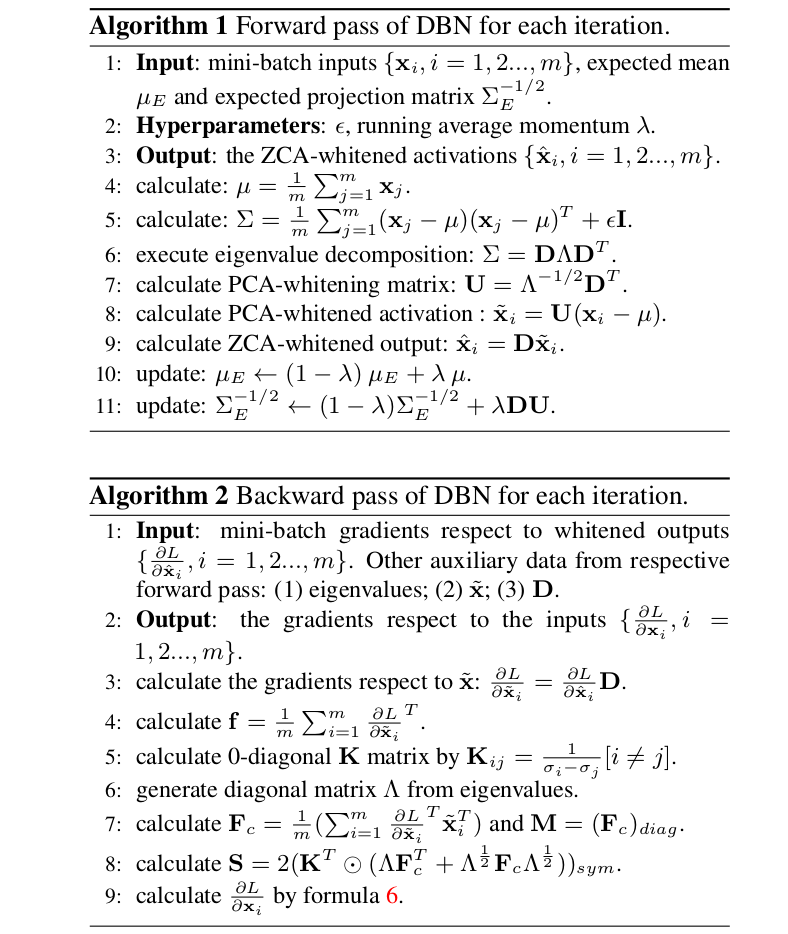

## 2018-07-11

**《Decorrelated Batch Normalization》**  

**CVPR 2018**  

**Abstract:** Batch Normalization在加速深度模型训练中很强力，通过在mini-batch中的中心化和缩放激活值。本文中，我们提出Decorrelated Batch Normalization(DBN)，它不仅中心化和缩放激活值，还白化它们。我们尝试多种白化操作，发现PCA白化引起一个我们称之为随机坐标轴对换的问题，不利于训练。我们展示ZCA白化不会忍受这个问题，允许成功训练。DBN保留BN令人满意的质量，进一步改进BN的优化效率和泛化能力。我们进行大量的实验展示，DBN可以在多层感知机和卷积神经网络上改进BN的性能。更多的，我们坚实的改进残差网络在CIFAR-10、CIFAR-100和ImageNet上的准确度。  

**Note:**  
1. Batch Normalization performs standardization on mini-batch inputs, that is not enough. We add ZCA whitening operation, not using PCA because it will cause stochastic axis swapping.
2. There are a lot of formulas that cant be written here, because github dont support Markdown gammar for README.md. It is a clear derivation, including forward pass and backward pass.  
3. Origin derivation asume that the shape of input is R-(d×m), where d is the dimension of one sample and m is mini-batch size. For a convolulation neural network, the shape of input is R-(h×w×d×m), where h and w means height and width respectively and d is the number of feature maps and m is mini-batch size. We view each spatial position of the feature map as a sample, then unroll the input Xc with dimension R-(h×w×d×m) as X with dimension R-(d×(mhw)), with mhw examples and d feature maps. Whitening operation is performed over this unrolled X.
4. Given a particular batch size, DBN　may not have enough samples to obtain a suitable estimate for covariance matrix. So for a out put of dimension d, we divide it into several groups, which have size kG less than d, and apply whitening within each group.

**Framework:**  

**Code:**
https://github.com/umich-vl/DecorrelatedBN  

**Link:** https://arxiv.org/abs/1803.05858  
