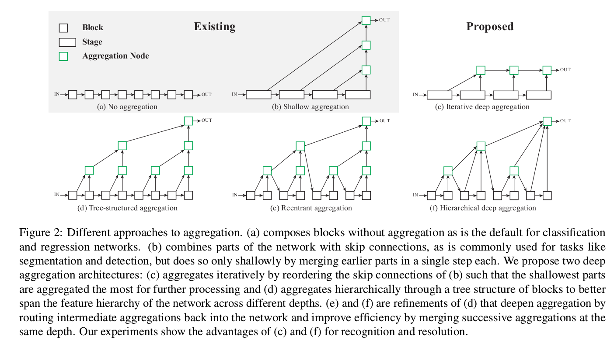
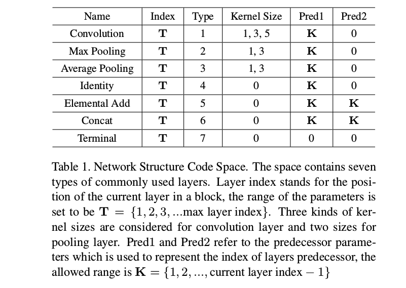

## 2018-07-12

**《Deep Layer Aggregation》**  

**CVPR 2018**  

**Abstract:** 视觉识别需要丰富的表征，跨越低层到高层，尺度从小到大，分辨率从细到粗。尽管有着卷积网络中的深度特征，孤立的层并不够，组合和累加这些表征改进位置和类别的推断。对于网络主干，架构上的努力在很多角度被探索，更深或更宽的网络，但如何横跨网络最好的累加层和块需要进一步注意。尽管skip connections已经被引入来组合这些层，这些链接已经将自己变浅了，只是简单的融合，一步操作。我们讨论更深的累加标准结构来更好的跨层融合信息。我们的deep layer aggregation结构迭代的和分层的合并分层特征，来使网络更准确且更少参数。跨越架构和任务的实验显示deep layer aggregation相比现存的分支合并组合改进了识别和分辨率。  

**Note:**  
1. 1st-block is like residual block, with a shortcut in it.  

2. 2nd-block = 1st-block × 2, with a shortcut between the top aggregation nodes of the two 1st-blocks, and a shortcut between input and output. The output is a aggregation of input and output of the first 1th-block and output of the second 1th-block.   

3. 3rd-block = 2nd-block × 2, with a shortcut between the top aggregation nodes of the two 2nd-blocks, and a shortcut between input and output. The output is a aggregation of input and output of the first 2nd-block and output of the second 2nd-block.  

4. (n)th-block = (n-1)th-block × 2, with a shortcut between the top aggregation nodes of the two (n-1)th-blocks, and a shortcut between input and output. The output is a aggregation of input and output of the first (n-1)th-block and output of the second (n-1)th-block.  

5. generate n blocks recursively, link then as a backbone.

**Framework:**  

**Code:**  

**Link:** http://openaccess.thecvf.com/content_cvpr_2018/html/Yu_Deep_Layer_Aggregation_CVPR_2018_paper.html  

---
**《Practical Block-wise Neural Network Architecture Generation》**  

**CVPR 2018**  

**Abstract:** 卷积神经网络已经在计算机视觉领域取得显著的成功。然而，大多数使用的网络架构是人为制作的，经常需要专门的精心的制作。本文中，我们提供一个块级网络生成流程，叫做BlockQNN, 使用具有epsilon-greedy探索策略的Q-Learning范式自动构建高性能网络。优化的网络块通过被训练为序列选择组件层的learning agent构建。我们堆叠这些块构建整个自动生成网络。为了加快生成流程，我们也提出一个分布异步框架和提早停止策略。块级生成带来独特的优势：(1)在图像分类上，它执行出与人工制作的最近水平网络相比有竞争力的结果，另外，BlockQNN生成的最好网络在CIFAR-10上获得3.54%　top-1 error rate，这击败了所有已存在的自动生成网络。(2)同时，它在寻找网络上提供了巨大的搜索空间的降低，只用32个GPU花了3天时间，以及(3)更进一步，它有很强的泛化能力，在CIFAR上构建的网络在更大尺度的ImageNet数据集上也表现很好。  

**Note:**  
1. Base on Q-learning, even Deep Q-learning?  

2. Each layer is represented by a 5 dimension vector using Network Structure Code that is convenience for forming a search space. Convolution operation regers  to a Pre-activation Convolutional Cell with ReLU+Convolution+BatchNormalization.     

3. Search a better convblock and stack them, not a whole network. That reduce the searching space.  

4. Intermediate(immediate) reward is shaped using rt=rT/T. FLOPs and Density are added to reward function for early stop.  

**Framework:**  

**Code:**  

**Link:** http://openaccess.thecvf.com/content_cvpr_2018/html/Zhong_Practical_Block-Wise_Neural_CVPR_2018_paper.html  
